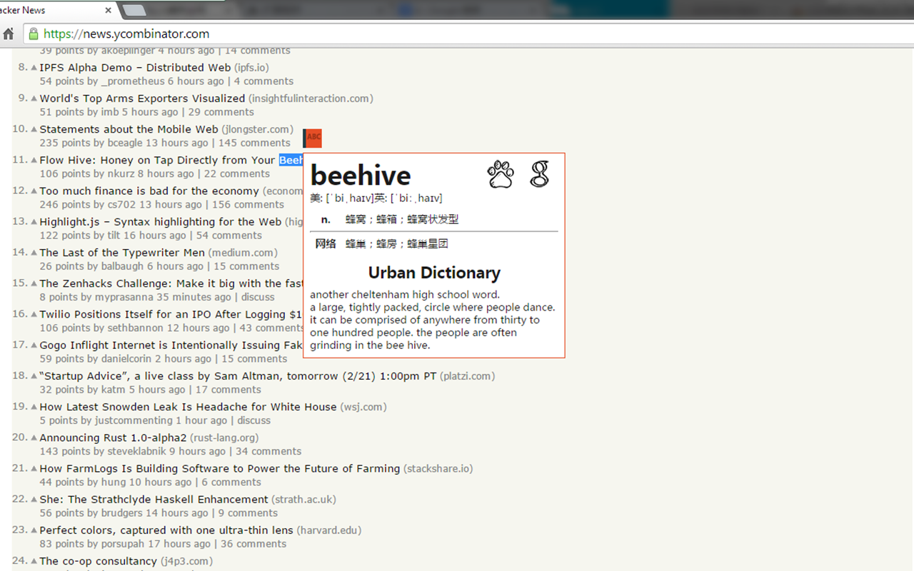

多词典划译
==========

<a target="_blank" href="https://chrome.google.com/extensions/detail/cdonnmffkdaoajfknoeeecmchibpmkmg"></a>

[Google Web Store](https://chrome.google.com/extensions/detail/cdonnmffkdaoajfknoeeecmchibpmkmg) 或者 [直接下载 crx](https://github.com/Crimx/hybrid-translator/releases/tag/3.0.0)

Chrome 扩展，网页划词翻译。

必应词典+ 已改名为多词典划译，混合多个结果，仅做编程技术交流，请低调使用，嘘~~。




版本
----

3.0.1

1. 增加了划译开关
2. 增加了 urban 词典的例子
3. 增加了必应搜索图标
4. 搜索图标右击可以变成翻译搜索
5. 修复了几处错误并加速了结果显示

开发
----

- 安装 [node.js](http://nodejs.org/) 和 [npm](https://www.npmjs.org/)

- 全局安装 [grunt-cli](http://gruntjs.com/getting-started)

  ```
  npm install -g grunt-cli
  ```

- 安装项目依赖，项目根目录运行

  ```
  npm install
  ```

- 启动 grunt，项目根目录运行

  ```
  grunt
  ```

- Chrome 加载 `/build/dev/`

- 在 `/src/` 下开发
